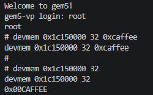

# gem5-sim

## Build & Install
1. Clone the repository including submodules:
    ```bash
    git clone --recursive git@github.com:rpelke/gem5-sim.git
    ```

1. Build gem5:
    ```bash
    python3 -m venv .venv
    source .venv/bin/activate
    pip install -r requirements.txt
    pip install -r gem5/requirements.txt
    ./gem5/util/pre-commit-install.sh
    ./build_gem5.bash
    ```

    If you want to rebuild gem5 later on, you can use:
    ```bash
    cd gem5
    scons build/ARM/gem5.opt -j`nproc`
    ```

    If you want to also build the `dummy_mmio` device, you can use:
    ```bash
    # ${PWD} points to the repositories working directory
    export EXTRAS_DIR=${PWD}/accelerator
    cd gem5
    scons build/ARM/gem5.opt EXTRAS=${EXTRAS_DIR} -j`nproc`
    ```

1. Build the software (Linux image, etc.): Follow the steps in this [README.md](images/README.md).

1. Start the VP:
    ```bash
    ./start_vp.bash
    ```

<a id="dummy-mmio"></a>
*   (Optional)
    To attach the (out-of-tree) [`DummyMmio`](accelerator/python/DummyMmio.py) device to the bus, use:
    ```bash
    ./start_vp.bash --dummy-mmio
    ```

    If not specified otherwise, the device is attached by default at address `0x1c150000`.

    To test the `DummyMmio` device, you can use `devmem`.
    `devmem` is a small Linux userspace tool which can directly read and write memory-mapped physical addresses. This makes it useful for quickly testing MMIO devices without writing a kernel driver first.

    To write `0xcaffee` to the device register from Linux, use:
    ```bash
    devmem 0x1c150000 64 0xcaffee
    ```

    To read the register value back, use:
    ```bash
    devmem 0x1c150000 64
    ```

    You should get the following output:

    

## Debugging
1. Set the environment variables for the GDB script:
    ```bash
    # ${PWD} points to the repositories working directory
    export LINUX_KERNEL_ELF=${PWD}/images/system/binaries/vmlinux
    # Insert path to 'gem5_sw' repository
    export BUILDROOT_SRC=<path-to-gem5_sw>/BUILD/buildroot
    ```

1. Start GDB:
    ```bash
    gdb-multiarch -x gdb-config
    (gdb) connect
    ```

## Some Useful Commands

- Convert the binary device tree `system.dtb` into the readable source file `system.dts`:
    ```bash
    dtc -I dtb -O dts -o system.dts system.dtb
    ```

- Convert the device tree source `system.dts` back into the binary `system.dtb`:
    ```bash
    dtc -I dts -O dtb -o system.dtb system.dts
    ```

- Connect to the gem5 terminal interface exposed on TCP port `3456` to interact with the Linux system, for example to run commands normally inside the guest:
    ```bash
    telnet localhost 3456
    ```

## Example: Testing the `my_custom_peripheral` Driver

- Make sure the driver is build in [gem5_sw](https://github.com/rpelke/gem5_sw).

- Start the VP with the `--dummy-mmio` flag (see [DummyMmio setup](#dummy-mmio)).

- Load the driver module:
    ```bash
    modprobe my_custom_peripheral
    ```
    (To unload the module, use `rmmod my_custom_peripheral`.)

- List registered kernel drivers containing "my_" in name:
    ```bash
    cat /proc/devices | grep my_
    ```
    You should get `245 my_custom_peripheral`.

- Check the device class in sysfs:
    ```bash
    ls /sys/class
    ```
    You should see `my_custom_peripheral` somewhere.

    This directory is part of **sysfs** and contains metadata about your device.
    You can inspect the device instance with
    `ls /sys/class/my_custom_peripheral/`.

- Check the device node:
    ```bash
    ls /dev
    ```
    You should see `my_custom_peripheral` somewhere.
    This is the **character device file** created via `udev`.
    It is the interface used by user-space applications to interact with the driver (e.g., via `open`, `read`, `write`, `ioctl`).
